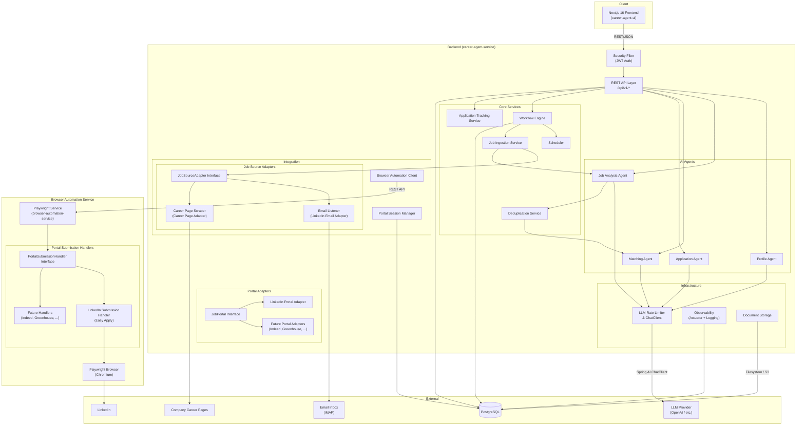
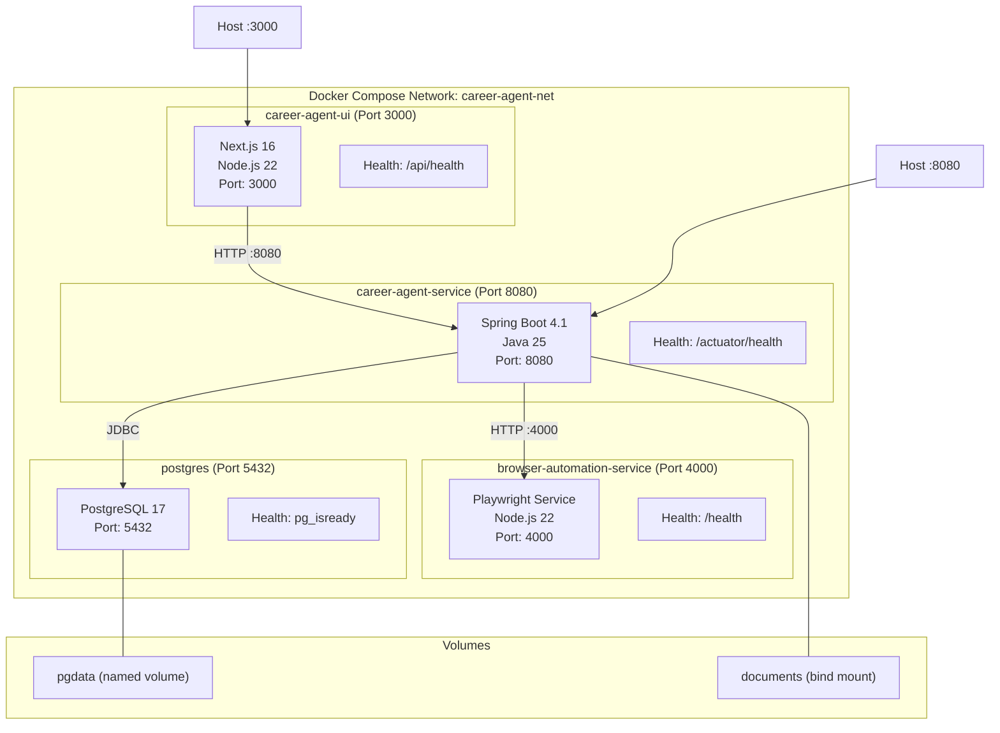
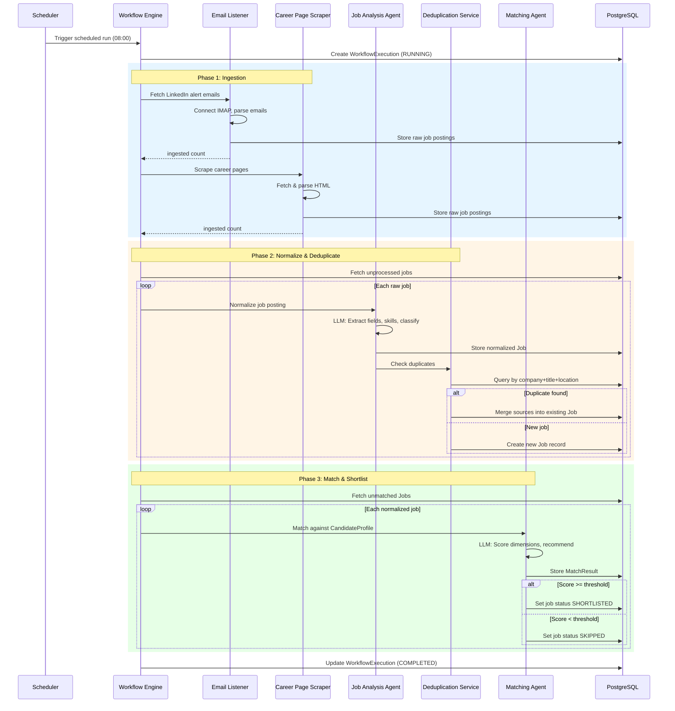
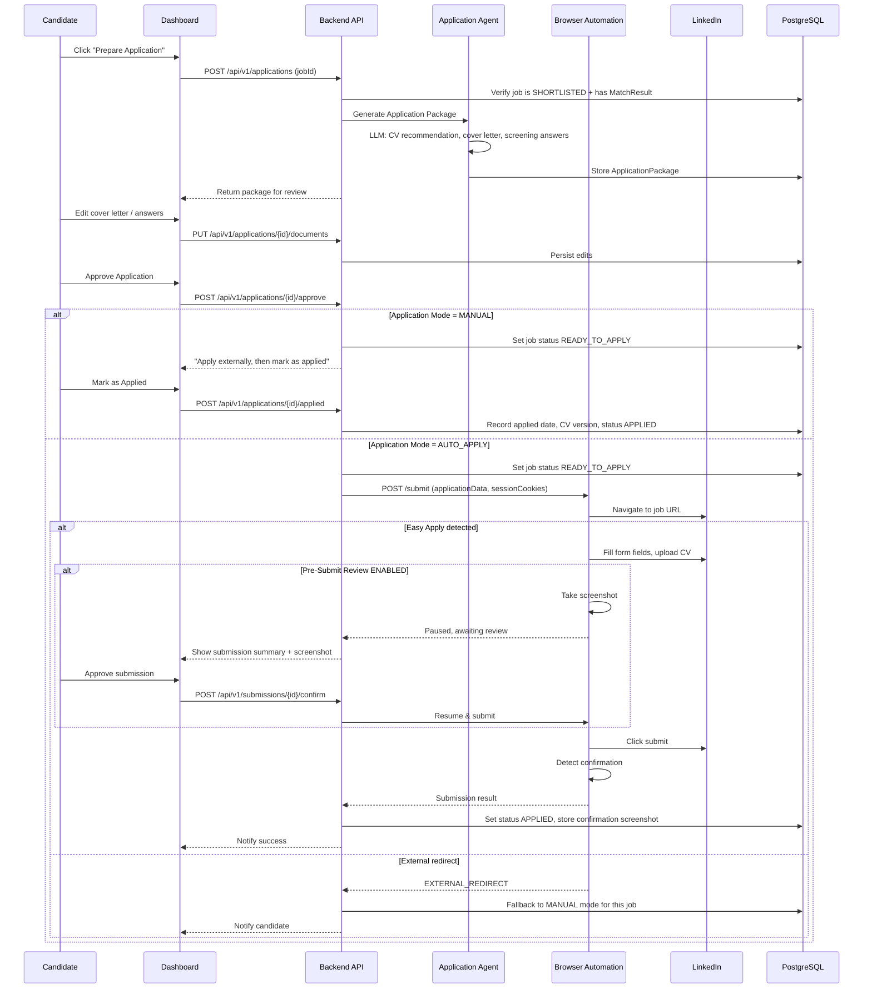
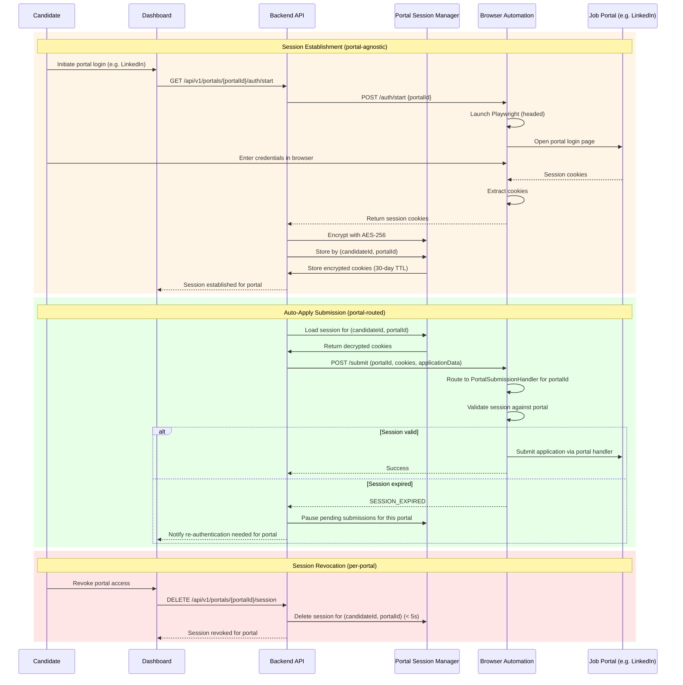
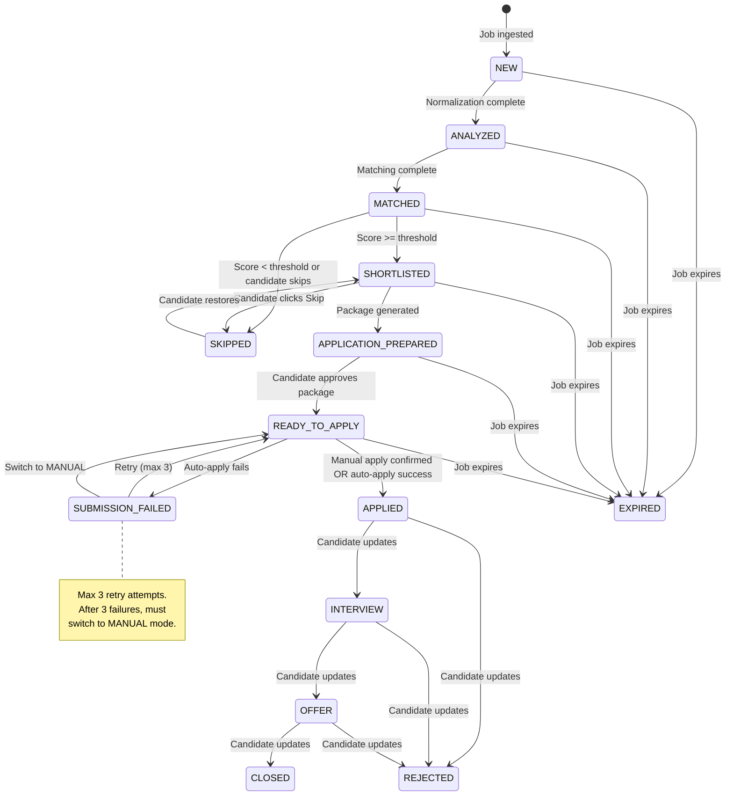
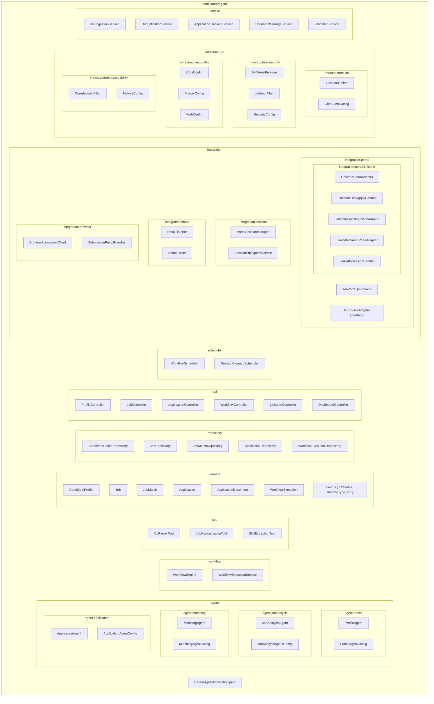
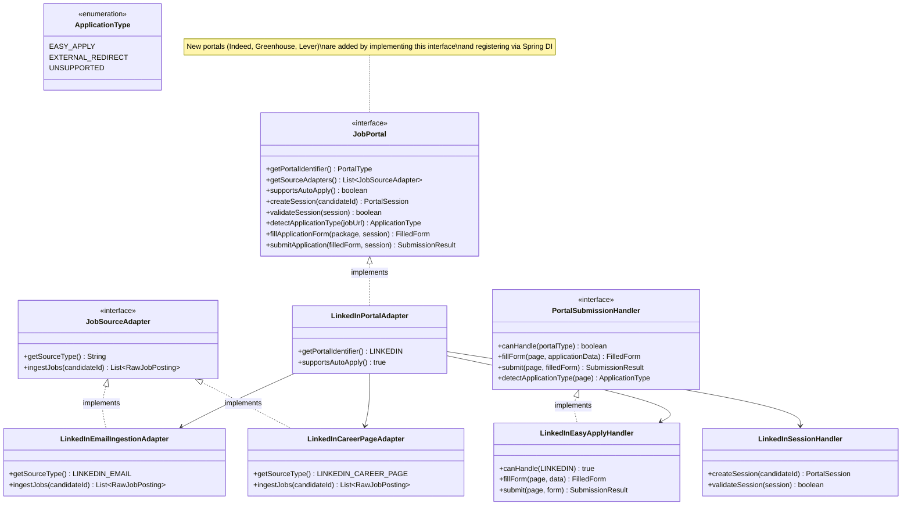
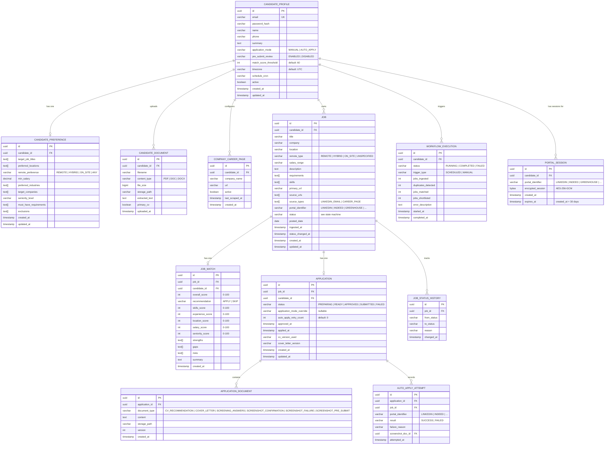

# Design Document: Career Agent

## Overview

The Career Agent is an AI-powered job search assistant that automates job discovery, matching, and application preparation. It consists of three deployable units: a Spring Boot 4.1 backend (the core API and AI agent orchestrator), a Next.js 16 frontend (the candidate dashboard), and a Playwright-based browser automation service (for LinkedIn auto-apply). All three run as Docker containers orchestrated via Docker Compose.

The backend is a single Maven project — not microservices — with well-defined packages for each AI agent, domain logic, integrations, and infrastructure. Spring AI 2.0.1 powers four agents (Profile, Job Analysis, Matching, Application) through a unified ChatClient abstraction. PostgreSQL stores all persistent state, managed by Flyway migrations. JWT-based authentication secures all API endpoints.

The system is built on a pluggable Job_Portal abstraction layer. Each job portal (LinkedIn, Indeed, Greenhouse, etc.) is represented by a Portal_Adapter that implements a common interface for job ingestion, session management, application form detection, form filling, and submission. LinkedIn is the first (MVP) portal; new portals can be added by registering a new adapter via Spring dependency injection without modifying core workflow, matching, or application logic. Job ingestion sources (email alerts, career page scraping, API feeds) are similarly abstracted behind a Job_Source_Adapter interface, allowing each portal to contribute one or more ingestion adapters.

The system executes a scheduled workflow (ingest → normalize → deduplicate → match → shortlist) daily, pulling jobs from all registered Job_Source_Adapters. Candidates interact through the Next.js dashboard to review matches, prepare applications, and optionally auto-apply via the Browser Automation Service, which routes submissions to the appropriate Portal_Adapter based on the job's portal identifier.

### Key Design Decisions

| Decision | Rationale |
|---|---|
| Monolithic backend with package separation | Simpler deployment, shared transaction context, easier debugging. Agents share domain model directly. |
| Separate Next.js frontend | Independent deployment lifecycle, SSR/SSG capabilities, modern React ecosystem. |
| Separate Browser Automation Service | Playwright requires Node.js runtime; isolating it prevents browser crashes from affecting the core API. Communication via REST API. |
| Spring AI ChatClient abstraction | Provider independence — switch between OpenAI, Anthropic, or local models without code changes. |
| PostgreSQL only | Single database simplifies operations. JSONB columns handle semi-structured data (MatchResult dimensions, screening answers). |
| JWT stateless auth | No server-side session storage. Scales horizontally without sticky sessions. |
| Portal Adapter pattern | Pluggable architecture for job portals. LinkedIn first, extensible to Indeed, Greenhouse, Lever, etc. without modifying core workflow, matching, or application logic. New adapters registered via Spring DI are automatically included in discovery workflows. |
| Per-portal session storage | Sessions keyed by (candidateId, portalId) with AES-256 encryption. Candidates can maintain concurrent active sessions across multiple portals independently. |
| REST API between services | Simpler than MCP for the browser automation use case. MCP reserved for future agent-to-agent communication. |

## Architecture

### System Architecture Diagram



### Deployment Diagram



### Job Discovery & Matching Workflow



### Application Preparation & Submission Workflow



### Portal Session & Auto-Apply Flow



### Job Status State Machine



## Components and Interfaces

### Backend Package Structure



### Spring AI Agent Configuration

Each agent is a Spring Bean that wraps a `ChatClient` instance with a specific system prompt and optional tools. Spring AI 2.0.1 on Spring Boot 4.1 provides the `ChatClient.Builder` for fluent configuration.

### Portal Adapter Class Diagram



```java
// Example: MatchingAgent configuration
@Configuration
public class MatchingAgentConfig {

    @Bean
    public ChatClient matchingChatClient(ChatClient.Builder builder) {
        return builder
            .defaultSystem(ResourceUtils.readPrompt("prompts/matching-agent.md"))
            .defaultFunctions("getJobDetails", "getCandidateProfile", "storeMatchResult")
            .build();
    }
}

@Service
public class MatchingAgent {
    private final ChatClient chatClient;
    
    public MatchResult matchJob(Job job, CandidateProfile profile) {
        return chatClient.prompt()
            .user(buildMatchingPrompt(job, profile))
            .call()
            .entity(MatchResult.class);
    }
}
```

System prompts live in `src/main/resources/prompts/` as Markdown files:
- `profile-agent.md` — CV extraction instructions, output schema
- `job-analysis-agent.md` — Normalization rules, skill extraction, field classification
- `matching-agent.md` — Scoring rubric, dimension weights, recommendation logic
- `application-agent.md` — Cover letter style, screening question strategy

### LLM Rate Limiting Architecture

The `LlmRateLimiter` implements a token-bucket algorithm with an overflow queue:

```java
@Component
public class LlmRateLimiter {
    private final Semaphore permits;        // 30 permits per minute (configurable)
    private final BlockingQueue<Runnable> queue; // max 500 pending requests
    private final ScheduledExecutorService refiller;

    // Acquire a permit or queue the request
    // Throws QueueFullException if queue reaches 500
    // Refills permits every minute
}
```

- Default: 30 calls/minute, queue capacity 500
- Each agent call acquires a permit before invoking ChatClient
- Timeout per LLM call: 120 seconds (treated as transient failure → retry)
- Retry: exponential backoff, 3 retries, initial delay 2s

### Browser Automation Service API

The Browser Automation Service exposes a REST API on port 4000 and uses a plugin architecture for portal-specific submission handlers:

| Endpoint | Method | Description |
|---|---|---|
| `/health` | GET | Service status, browser state, submission counts |
| `/auth/start` | POST | Launch headed browser for portal login (portalId in body) |
| `/auth/validate` | POST | Validate session cookies against a specific portal |
| `/submit` | POST | Submit application via the appropriate portal handler |
| `/submit/{id}/confirm` | POST | Resume paused pre-submit review |
| `/submit/{id}/cancel` | POST | Cancel paused submission |

Rate limits enforced by the service: 10 submissions/hour, 30 submissions/day per candidate. Randomized delay 30–90 seconds between consecutive submissions.

#### Portal Submission Handler Plugin Architecture

The Browser Automation Service uses a `PortalSubmissionHandler` interface to support multiple job portals. Each handler is a separate module that can be added without modifying the core service logic:

```typescript
// Core interface — implemented by each portal handler module
interface PortalSubmissionHandler {
  portalType: PortalType;
  canHandle(portalType: PortalType): boolean;
  detectApplicationType(page: Page, jobUrl: string): Promise<ApplicationType>;
  fillForm(page: Page, applicationData: ApplicationData): Promise<FilledForm>;
  submit(page: Page, filledForm: FilledForm): Promise<SubmissionResult>;
}

// LinkedIn handler (first implementation)
class LinkedInSubmissionHandler implements PortalSubmissionHandler {
  portalType = PortalType.LINKEDIN;
  // Handles Easy Apply: single-page, multi-step (up to 10), file upload,
  // text input, dropdown, checkbox/radio
}

// Handler registry — routes requests to the correct handler
class PortalHandlerRegistry {
  private handlers: Map<PortalType, PortalSubmissionHandler>;
  register(handler: PortalSubmissionHandler): void;
  getHandler(portalType: PortalType): PortalSubmissionHandler;
}
```

When a submission request arrives, the service:
1. Extracts the `portalId` from the request
2. Looks up the registered `PortalSubmissionHandler` via `PortalHandlerRegistry`
3. Delegates form detection, filling, and submission to that handler
4. New portals are added by implementing `PortalSubmissionHandler` and registering the module

### Portal Session Encryption

```
┌─────────────────────────────────────────────┐
│  SessionEncryptionService                    │
│                                              │
│  Algorithm: AES-256-GCM                      │
│  Key source: PORTAL_ENCRYPTION_KEY env var   │
│  IV: Random 12 bytes per encryption          │
│  Storage: encrypted_session BYTEA column     │
│  TTL: 30 days (auto-cleanup scheduler)       │
│  Key: (candidate_id, portal_identifier)      │
│                                              │
│  encrypt(cookies) → IV + ciphertext + tag    │
│  decrypt(blob) → cookies                     │
│  delete(candidateId, portalId) → void (< 5s) │
│  deleteAll(candidateId) → void (< 5s)        │
└─────────────────────────────────────────────┘
```

The encryption key is an environment variable, never stored in the database. The `SessionCleanupScheduler` runs daily to delete sessions older than 30 days. Sessions are stored per (candidateId, portalIdentifier) pair, allowing concurrent sessions across multiple portals.

### Frontend Architecture

The Next.js 16 frontend communicates with the backend via REST API at `/api/v1/*`. Key architectural decisions:

- **State Management**: Zustand for global state (auth token, user preferences), `@tanstack/react-query` for server state (jobs, applications, matches)
- **API Layer**: Axios instance with JWT interceptor that attaches Bearer token and handles 401 refresh/redirect
- **Routing**: Next.js App Router with route groups for authenticated/public layouts
- **UI Components**: shadcn/ui components built on Radix UI primitives, styled with Tailwind CSS 4

Frontend route structure:
```
src/app/
├── (auth)/
│   ├── login/page.tsx
│   └── register/page.tsx
├── (dashboard)/
│   ├── layout.tsx              # Authenticated layout with sidebar
│   ├── profile/page.tsx        # Profile view/edit
│   ├── jobs/
│   │   ├── page.tsx            # Shortlist dashboard
│   │   └── [id]/page.tsx       # Job detail + match result
│   ├── applications/
│   │   ├── page.tsx            # Application tracking
│   │   └── [id]/page.tsx       # Application detail + package
│   ├── workflows/page.tsx      # Workflow history
│   └── settings/page.tsx       # App settings, LinkedIn auth
└── layout.tsx                  # Root layout
```

### JWT Authentication Flow

```
1. POST /api/v1/auth/login { email, password }
2. Backend validates credentials, checks bcrypt hash (cost factor 10)
3. Returns { accessToken: "eyJ...", expiresIn: 86400 }
4. Frontend stores token in memory (Zustand store)
5. Axios interceptor adds: Authorization: Bearer <token>
6. JwtAuthFilter extracts token, validates signature + expiry
7. Sets SecurityContext with candidate ID for downstream authorization
8. Resource-level authorization: candidateId from JWT must match resource owner
```

### CORS Configuration

CORS is configured via environment variables consumed by `CorsConfig`:

```yaml
cors:
  allowed-origins: ${CORS_ALLOWED_ORIGINS:http://localhost:3000}
  allowed-methods: ${CORS_ALLOWED_METHODS:GET,POST,PUT,DELETE,PATCH,OPTIONS}
  allowed-headers: ${CORS_ALLOWED_HEADERS:Authorization,Content-Type,X-Correlation-ID}
```

### Flyway Migration Strategy

- Scripts in `src/main/resources/db/migration/` following `V{version}__{description}.sql`
- Forward-only; no undo migrations
- Applied automatically on startup before accepting requests (120s max)
- Failure blocks application startup with logged error identifying the failed script

### Scheduled Workflow Execution

```java
@Component
public class WorkflowScheduler {
    @Scheduled(cron = "${workflow.schedule.cron:0 0 8 * * *}", 
               zone = "${workflow.schedule.timezone:UTC}")
    public void executeScheduledWorkflow() {
        workflowEngine.execute();
    }
}
```

- Default: daily at 08:00 UTC (candidate timezone override via config)
- Minimum interval: 1 hour
- Manual trigger via `POST /api/v1/workflows/trigger` (rejects if already running)
- Each run creates a `WorkflowExecution` record tracking status, timing, and counts

### Docker Compose Orchestration

```yaml
# docker-compose.yml structure
services:
  postgres:
    image: postgres:17
    healthcheck:
      test: pg_isready -U career_agent
      interval: 10s
      retries: 5
    volumes:
      - pgdata:/var/lib/postgresql/data
    ports: ["5432:5432"]

  career-agent-service:
    build: ./career-agent-service
    depends_on:
      postgres: { condition: service_healthy }
    healthcheck:
      test: curl -f http://localhost:8080/actuator/health
      interval: 30s
      retries: 3
    ports: ["8080:8080"]
    env_file: .env
    volumes:
      - ./documents:/app/documents

  career-agent-ui:
    build: ./career-agent-ui
    depends_on:
      career-agent-service: { condition: service_healthy }
    ports: ["3000:3000"]
    environment:
      - NEXT_PUBLIC_API_URL=http://career-agent-service:8080

  browser-automation-service:
    build: ./browser-automation-service
    depends_on:
      career-agent-service: { condition: service_healthy }
    healthcheck:
      test: curl -f http://localhost:4000/health
      interval: 30s
    ports: ["4000:4000"]

volumes:
  pgdata:
```

### Maven Dependencies (career-agent-service/pom.xml)

```xml
<parent>
    <groupId>org.springframework.boot</groupId>
    <artifactId>spring-boot-starter-parent</artifactId>
    <version>4.1.0</version>
</parent>

<properties>
    <java.version>25</java.version>
    <spring-ai.version>2.0.1</spring-ai.version>
</properties>

<dependencies>
    <!-- Spring Boot Core -->
    <dependency>
        <groupId>org.springframework.boot</groupId>
        <artifactId>spring-boot-starter-web</artifactId>
    </dependency>
    <dependency>
        <groupId>org.springframework.boot</groupId>
        <artifactId>spring-boot-starter-data-jpa</artifactId>
    </dependency>
    <dependency>
        <groupId>org.springframework.boot</groupId>
        <artifactId>spring-boot-starter-security</artifactId>
    </dependency>
    <dependency>
        <groupId>org.springframework.boot</groupId>
        <artifactId>spring-boot-starter-actuator</artifactId>
    </dependency>
    <dependency>
        <groupId>org.springframework.boot</groupId>
        <artifactId>spring-boot-starter-mail</artifactId>
    </dependency>
    <dependency>
        <groupId>org.springframework.boot</groupId>
        <artifactId>spring-boot-starter-validation</artifactId>
    </dependency>

    <!-- Spring AI -->
    <dependency>
        <groupId>org.springframework.ai</groupId>
        <artifactId>spring-ai-openai-spring-boot-starter</artifactId>
        <version>${spring-ai.version}</version>
    </dependency>
    <dependency>
        <groupId>org.springframework.ai</groupId>
        <artifactId>spring-ai-mcp</artifactId>
        <version>${spring-ai.version}</version>
    </dependency>

    <!-- Database -->
    <dependency>
        <groupId>org.postgresql</groupId>
        <artifactId>postgresql</artifactId>
        <scope>runtime</scope>
    </dependency>
    <dependency>
        <groupId>org.flywaydb</groupId>
        <artifactId>flyway-core</artifactId>
    </dependency>
    <dependency>
        <groupId>org.flywaydb</groupId>
        <artifactId>flyway-database-postgresql</artifactId>
    </dependency>

    <!-- Security -->
    <dependency>
        <groupId>io.jsonwebtoken</groupId>
        <artifactId>jjwt-api</artifactId>
        <version>0.12.6</version>
    </dependency>
    <dependency>
        <groupId>io.jsonwebtoken</groupId>
        <artifactId>jjwt-impl</artifactId>
        <version>0.12.6</version>
        <scope>runtime</scope>
    </dependency>
    <dependency>
        <groupId>io.jsonwebtoken</groupId>
        <artifactId>jjwt-jackson</artifactId>
        <version>0.12.6</version>
        <scope>runtime</scope>
    </dependency>

    <!-- Utilities -->
    <dependency>
        <groupId>org.projectlombok</groupId>
        <artifactId>lombok</artifactId>
        <optional>true</optional>
    </dependency>
    <dependency>
        <groupId>org.springdoc</groupId>
        <artifactId>springdoc-openapi-starter-webmvc-ui</artifactId>
        <version>2.8.0</version>
    </dependency>

    <!-- PDF Parsing -->
    <dependency>
        <groupId>org.apache.pdfbox</groupId>
        <artifactId>pdfbox</artifactId>
        <version>3.0.4</version>
    </dependency>
    <dependency>
        <groupId>org.apache.poi</groupId>
        <artifactId>poi-ooxml</artifactId>
        <version>5.3.0</version>
    </dependency>

    <!-- Test -->
    <dependency>
        <groupId>org.springframework.boot</groupId>
        <artifactId>spring-boot-starter-test</artifactId>
        <scope>test</scope>
    </dependency>
    <dependency>
        <groupId>org.springframework.security</groupId>
        <artifactId>spring-security-test</artifactId>
        <scope>test</scope>
    </dependency>
    <dependency>
        <groupId>net.jqwik</groupId>
        <artifactId>jqwik</artifactId>
        <version>1.9.2</version>
        <scope>test</scope>
    </dependency>
</dependencies>
```

### Frontend Dependencies (career-agent-ui/package.json)

```json
{
  "name": "career-agent-ui",
  "version": "0.1.0",
  "dependencies": {
    "next": "^16.0.0",
    "react": "^19.0.0",
    "react-dom": "^19.0.0",
    "axios": "^1.7.0",
    "@tanstack/react-query": "^5.60.0",
    "zustand": "^5.0.0",
    "date-fns": "^4.1.0",
    "zod": "^3.24.0",
    "lucide-react": "^0.460.0"
  },
  "devDependencies": {
    "typescript": "^5.7.0",
    "tailwindcss": "^4.0.0",
    "@tailwindcss/postcss": "^4.0.0",
    "@types/node": "^22.0.0",
    "@types/react": "^19.0.0",
    "eslint": "^9.0.0",
    "eslint-config-next": "^16.0.0",
    "fast-check": "^3.23.0",
    "vitest": "^3.0.0",
    "@testing-library/react": "^16.0.0"
  }
}
```

### Browser Automation Service Dependencies (browser-automation-service/package.json)

```json
{
  "name": "browser-automation-service",
  "version": "0.1.0",
  "dependencies": {
    "express": "^5.0.0",
    "playwright": "^1.50.0",
    "winston": "^3.17.0",
    "helmet": "^8.0.0",
    "express-rate-limit": "^7.5.0",
    "zod": "^3.24.0"
  },
  "devDependencies": {
    "typescript": "^5.7.0",
    "@types/express": "^5.0.0",
    "@types/node": "^22.0.0",
    "vitest": "^3.0.0",
    "fast-check": "^3.23.0"
  }
}
```

## Data Models

### Database ER Diagram



### Key Domain Enums

```java
public enum JobStatus {
    NEW, ANALYZED, MATCHED, SHORTLISTED,
    APPLICATION_PREPARED, READY_TO_APPLY, APPLIED,
    INTERVIEW, OFFER, CLOSED,
    // Side statuses
    REJECTED, SKIPPED, EXPIRED, SUBMISSION_FAILED
}

public enum RemoteType { REMOTE, HYBRID, ON_SITE, UNSPECIFIED }
public enum SourceType { LINKEDIN_EMAIL, LINKEDIN_CAREER_PAGE, INDEED_API, GREENHOUSE_API, CAREER_PAGE }
public enum PortalType { LINKEDIN, INDEED, GREENHOUSE, LEVER }
public enum ApplicationMode { MANUAL, AUTO_APPLY }
public enum ApplicationType { EASY_APPLY, EXTERNAL_REDIRECT, UNSUPPORTED }
public enum PreSubmitReview { ENABLED, DISABLED }
public enum Recommendation { APPLY, SKIP }
public enum SeniorityLevel { INTERN, JUNIOR, MID, SENIOR, LEAD, EXECUTIVE }
```

`SourceType` values follow a portal prefix pattern (e.g., `LINKEDIN_EMAIL`, `INDEED_API`) to support arbitrary portal identifiers registered through the Job_Portal abstraction layer. `PortalType` is extensible — new values are added when a new Portal_Adapter is implemented.

### Valid Status Transitions

| From | To (valid) |
|---|---|
| NEW | ANALYZED, EXPIRED |
| ANALYZED | MATCHED, EXPIRED |
| MATCHED | SHORTLISTED, SKIPPED, EXPIRED |
| SHORTLISTED | APPLICATION_PREPARED, SKIPPED, EXPIRED |
| APPLICATION_PREPARED | READY_TO_APPLY, EXPIRED |
| READY_TO_APPLY | APPLIED, SUBMISSION_FAILED, EXPIRED |
| SUBMISSION_FAILED | READY_TO_APPLY (retry ≤ 3) |
| APPLIED | INTERVIEW, REJECTED |
| INTERVIEW | OFFER, REJECTED |
| OFFER | CLOSED, REJECTED |
| SKIPPED | SHORTLISTED (restore) |

## Correctness Properties

*A property is a characteristic or behavior that should hold true across all valid executions of a system — essentially, a formal statement about what the system should do. Properties serve as the bridge between human-readable specifications and machine-verifiable correctness guarantees.*

### Property 1: Profile Validation Completeness

*For any* Candidate_Profile, the profile SHALL only be marked as active if it contains at least one target job title and one preferred location. Conversely, *for any* profile missing either field, activation SHALL be rejected.

**Validates: Requirements 1.4**

### Property 2: CV Upload Constraints Enforcement

*For any* document upload request, the system SHALL accept the document if and only if its format is PDF, DOC, or DOCX, its size is ≤ 5 MB, and the candidate has fewer than 5 existing documents. All other uploads SHALL be rejected with appropriate validation errors.

**Validates: Requirements 2.3**

### Property 3: Profile Preference Validation Round-Trip

*For any* valid set of candidate preferences (salary between 0.01 and 999,999,999.99, seniority in the allowed set, locations as non-empty strings ≤ 200 characters with ≤ 20 entries), saving and then reading the preferences SHALL produce equivalent values. Invalid preferences SHALL be rejected without altering stored data.

**Validates: Requirements 2.2, 2.5**

### Property 4: Profile Deletion Cascades Completely

*For any* Candidate_Profile that is deleted, querying for associated preferences, documents, and stored files SHALL return empty results. No orphaned data SHALL remain.

**Validates: Requirements 2.4**

### Property 5: Authorization Isolation

*For any* two distinct candidates A and B, candidate A SHALL never be able to read, update, or delete any resource (profile, jobs, matches, applications) owned by candidate B. All such cross-candidate requests SHALL return 403.

**Validates: Requirements 2.6, 12.4, 12.5**

### Property 6: Email Deduplication by URL

*For any* sequence of job postings extracted from LinkedIn emails, if two postings share the same job URL, only one Job record SHALL exist in the data store. The count of distinct records SHALL equal the count of distinct job URLs.

**Validates: Requirements 3.5**

### Property 7: Career Page URL Validation

*For any* URL string submitted as a company career page, the system SHALL accept it if and only if it is ≤ 2048 characters, conforms to valid URL syntax, and uses the HTTPS protocol. All non-conforming URLs SHALL be rejected with a specific validation error.

**Validates: Requirements 4.6, 4.7**

### Property 8: Job Normalization Schema Completeness

*For any* raw job posting processed by the Job_Analysis_Agent, the resulting normalized Job SHALL contain all required fields (title, company, location, remoteType, salaryRange, description, requirements, skills, url, source, postedDate) with no field omitted. Undetermined fields SHALL use UNSPECIFIED indicator values.

**Validates: Requirements 5.1, 5.4**

### Property 9: Remote Type Classification

*For any* normalized Job, its remoteType SHALL be exactly one of REMOTE, HYBRID, ON_SITE, or UNSPECIFIED. No other value SHALL appear.

**Validates: Requirements 5.2**

### Property 10: Deduplication Merge Preserves Sources

*For any* two Job postings with matching company (case-insensitive), title (case-insensitive), and location (case-insensitive), after deduplication exactly one Job record SHALL exist, and that record SHALL contain all distinct source URLs and source identifiers from both original postings.

**Validates: Requirements 6.1, 6.2, 6.3**

### Property 11: Match Score Determines Shortlist Status

*For any* Job with a completed MatchResult, if the overall score is ≥ the configured threshold then the job status SHALL be SHORTLISTED; if below the threshold, the status SHALL be SKIPPED. The threshold is an integer between 1 and 100.

**Validates: Requirements 7.4, 7.5, 7.7**

### Property 12: MatchResult Structural Validity

*For any* MatchResult produced by the Matching_Agent, the overall score and all dimension scores SHALL be integers in [0, 100], the recommendation SHALL be APPLY or SKIP, strengths SHALL have 1–10 entries, gaps SHALL have 0–10 entries, and risks SHALL have 0–10 entries.

**Validates: Requirements 7.2, 7.3**

### Property 13: Job Status Transition Validity

*For any* job status change request, the transition SHALL succeed if and only if the (from_status, to_status) pair is in the valid transitions table. Invalid transitions SHALL be rejected with an error listing the current status and valid next statuses.

**Validates: Requirements 10.1, 10.2, 10.6**

### Property 14: Status History Completeness

*For any* Job that has undergone N status transitions, the job_status_history table SHALL contain exactly N records for that job, each with a timestamp, and the sequence of to_status values SHALL reconstruct the job's status progression.

**Validates: Requirements 10.5**

### Property 15: Pagination Metadata Consistency

*For any* paginated API response with total_elements T, page_size S (1 ≤ S ≤ 100), the total_pages SHALL equal ⌈T / S⌉, the current page SHALL contain at most S items, and the sum of items across all pages SHALL equal T.

**Validates: Requirements 18.5, 8.7**

### Property 16: Input Sanitization Idempotence

*For any* user-provided text input, applying HTML tag stripping and script removal twice SHALL produce the same result as applying it once. The sanitization operation SHALL be idempotent.

**Validates: Requirements 13.4**

### Property 17: Error Response Format Consistency

*For any* API error response (4xx or 5xx), the response body SHALL contain exactly the fields: timestamp (ISO 8601), status (HTTP code), error (type string), message (description), and path (request URI). No field SHALL be missing.

**Validates: Requirements 13.3, 18.6**

### Property 18: Password Validation Rules

*For any* registration password string, the system SHALL accept it if and only if its length is between 8 and 128 characters and it contains at least one uppercase letter, one lowercase letter, and one digit. All non-conforming passwords SHALL be rejected.

**Validates: Requirements 12.6**

### Property 19: LLM Retry Exhaustion Marks Failure

*For any* LLM call that fails with a transient error, the system SHALL retry with exponential backoff up to 3 times. If all 3 retries are exhausted, the originating task SHALL be marked as failed. *For any* successful retry (retry ≤ 3), the task SHALL proceed normally.

**Validates: Requirements 14.2, 14.3**

### Property 20: Auto-Apply Retry Limit Enforcement

*For any* job in SUBMISSION_FAILED status, the system SHALL allow auto-apply retries if and only if the retry count is < 3. After 3 failed attempts, further auto-apply retries SHALL be blocked.

**Validates: Requirements 23.4, 23.9**

### Property 21: Application Mode Inheritance

*For any* job without an explicit application mode override, the effective application mode SHALL equal the candidate's global Application_Mode. *For any* job with an explicit override, the override SHALL take precedence regardless of the global setting.

**Validates: Requirements 19.4**

### Property 22: Text Field Length Enforcement

*For any* text input exceeding its maximum length constraint (profile name: 200, job title: 300, free-text: 5000 characters), the system SHALL reject the input with a validation error specifying the field name, maximum allowed length, and actual input length. Inputs within limits SHALL be accepted.

**Validates: Requirements 13.5**

### Property 23: Workflow Execution Mutual Exclusion

*For any* candidate, at most one workflow execution SHALL have status RUNNING at any time. A manual trigger while another execution is RUNNING SHALL be rejected.

**Validates: Requirements 11.6**

### Property 24: Portal Adapter Registration

*For any* set of Portal_Adapter implementations registered via Spring dependency injection, the workflow engine SHALL discover all registered adapters and include each adapter's job sources in the discovery workflow. *For any* registered adapter that reports `supportsAutoApply() = true`, the auto-apply capability SHALL be available; *for any* adapter that reports `supportsAutoApply() = false`, no auto-apply requests SHALL be routed to it.

**Validates: Requirements 24.3, 24.4, 24.5**

### Property 25: Portal Auto-Apply Routing

*For any* job with a stored portal identifier and an approved Application_Package, when auto-apply is triggered, the system SHALL route the submission request to the Portal_Adapter whose portal identifier matches the job's portal identifier. *For any* job whose portal identifier has no registered adapter supporting auto-apply, the submission request SHALL be rejected.

**Validates: Requirements 24.6, 24.7**

### Property 26: Portal Session Isolation

*For any* candidate with active sessions for N distinct portals, the system SHALL store exactly N separate session records keyed by (candidateId, portalIdentifier). *For any* session revocation targeting a specific portal, only that portal's session SHALL be deleted while all other portal sessions for the same candidate remain intact. *For any* account deletion, all portal sessions for that candidate SHALL be deleted.

**Validates: Requirements 21.1, 21.6, 21.7**

## Error Handling

### Error Categories and Strategies

| Category | Strategy | HTTP Code | Example |
|---|---|---|---|
| **Validation** | Reject with field-level errors | 400 | Invalid salary, missing required field |
| **Authentication** | Reject with reason | 401 | Expired JWT, malformed token, missing token |
| **Authorization** | Reject, no details | 403 | Cross-candidate resource access |
| **Not Found** | Reject with resource type | 404 | Job ID doesn't exist |
| **Conflict** | Reject with current state | 409 | Duplicate email, invalid status transition |
| **LLM Failure** | Retry with backoff, then fail task | 500 (internal) | Timeout, rate limit, provider error |
| **Email Connection** | Log and retry next run | N/A (async) | IMAP connection failure |
| **Scraping Failure** | Log, skip page, continue | N/A (async) | HTTP error, timeout on career page |
| **Browser Automation** | Notify candidate, set SUBMISSION_FAILED | N/A (async) | CAPTCHA, page structure change, session expiry |
| **Unhandled Exception** | Generic 500, full log | 500 | Unexpected runtime error |

### Consistent Error Response Format

All API errors follow this structure:

```json
{
  "timestamp": "2025-01-15T10:30:00Z",
  "status": 400,
  "error": "Validation Error",
  "message": "Profile validation failed",
  "path": "/api/v1/profiles",
  "details": [
    { "field": "salary", "message": "Must be between 0.01 and 999999999.99" }
  ]
}
```

The `details` array is present only for 400 validation errors.

### LLM Failure Handling

1. **Transient errors** (HTTP 429, 500, 502, 503, timeouts): Retry with exponential backoff (2s, 4s, 8s), max 3 retries
2. **Rate limit reached**: Queue request (max 500). Return queue-full error if capacity exceeded.
3. **All retries exhausted**: Mark task as failed, log error with agent name + job ID, continue processing remaining tasks
4. **Logging**: Every LLM call logged with agent name, token counts, latency, success/failure

### Browser Automation Failure Handling

1. **Session expired**: Pause all pending submissions, preserve in-progress state, notify candidate
2. **CAPTCHA**: Pause, notify candidate, wait up to 5 minutes. Timeout → SUBMISSION_FAILED
3. **Form validation error / unexpected page structure**: Screenshot failure state, set SUBMISSION_FAILED, notify within 60s
4. **External redirect (not Easy Apply)**: Report EXTERNAL_REDIRECT, fallback to MANUAL for that job
5. **Max retries (3)**: Block further auto-apply, notify candidate to switch to MANUAL

### Correlation-Based Tracing

Every request gets a UUID v4 correlation ID (`X-Correlation-ID` header or generated). This ID propagates through all log entries and downstream calls, enabling end-to-end request tracing across the backend and browser automation service.

## Testing Strategy

### Dual Testing Approach

This project uses both example-based unit tests and property-based tests for comprehensive coverage.

**Property-based testing is appropriate** for this feature because the backend contains significant pure business logic: validation rules, status transitions, deduplication matching, score-based classification, input sanitization, pagination math, and authorization checks. These are all functions with clear input/output behavior where universal properties hold across wide input spaces.

### Property-Based Testing Configuration

- **Backend (Java)**: [jqwik](https://jqwik.net/) — the standard PBT library for JUnit 5 on the JVM
- **Frontend (TypeScript)**: [fast-check](https://github.com/dubzzz/fast-check) — the standard PBT library for JavaScript/TypeScript
- **Minimum iterations**: 100 per property test
- **Each property test references its design document property**
- **Tag format**: `Feature: career-agent, Property {number}: {property_text}`

### Test Layers

| Layer | Tool | Focus | Examples |
|---|---|---|---|
| **Property tests** | jqwik / fast-check | Universal properties across all valid inputs | Validation rules, status transitions, deduplication, pagination math |
| **Unit tests** | JUnit 5 / Vitest | Specific examples, edge cases, error conditions | Email parsing edge cases, specific MatchResult formats, UI component rendering |
| **Integration tests** | Spring Boot Test + Testcontainers | Database interactions, Flyway migrations, API endpoint wiring | Repository queries, full request lifecycle, auth flow |
| **API tests** | MockMvc / WebTestClient | HTTP contract verification | Status codes, response format, CORS headers, pagination |
| **Frontend component tests** | Vitest + Testing Library | Component rendering, user interactions | Dashboard filtering, form validation, status display |
| **E2E tests** | Playwright | Full user workflows | Login → shortlist → prepare application → approve |

### Property Test Mapping

Each correctness property maps to a single property-based test:

| Property | Test Class / File | What Varies |
|---|---|---|
| P1: Profile Validation | `ProfileValidationPropertyTest` | Job titles list, locations list |
| P2: CV Upload Constraints | `DocumentUploadPropertyTest` | File format, size, existing doc count |
| P3: Preference Validation Round-Trip | `PreferenceRoundTripPropertyTest` | Salary values, seniority levels, location strings |
| P4: Deletion Cascades | `ProfileDeletionPropertyTest` | Profile with varying associated data |
| P5: Authorization Isolation | `AuthorizationIsolationPropertyTest` | Random candidate pairs, resource types |
| P6: Email Dedup by URL | `EmailDeduplicationPropertyTest` | Job URL sequences with varying duplicates |
| P7: Career Page URL Validation | `UrlValidationPropertyTest` | URL strings (length, scheme, syntax) |
| P8: Normalization Completeness | `NormalizationPropertyTest` | Raw job data with missing/present fields |
| P9: Remote Type Classification | `RemoteTypePropertyTest` | Job postings with varied location descriptions |
| P10: Dedup Merge Sources | `DeduplicationMergePropertyTest` | Job pairs with matching/different fields |
| P11: Score Determines Status | `MatchScoreStatusPropertyTest` | Scores 0–100, thresholds 1–100 |
| P12: MatchResult Validity | `MatchResultStructurePropertyTest` | Score ranges, list lengths |
| P13: Status Transition Validity | `StatusTransitionPropertyTest` | All (from, to) status pairs |
| P14: Status History Completeness | `StatusHistoryPropertyTest` | Random transition sequences |
| P15: Pagination Consistency | `PaginationPropertyTest` | Total elements, page sizes |
| P16: Sanitization Idempotence | `SanitizationPropertyTest` | HTML strings with scripts, tags, nested content |
| P17: Error Response Format | `ErrorResponseFormatPropertyTest` | Different error types and status codes |
| P18: Password Validation | `PasswordValidationPropertyTest` | Random strings varying length, character classes |
| P19: LLM Retry Exhaustion | `LlmRetryPropertyTest` | Failure sequences of varying lengths |
| P20: Auto-Apply Retry Limit | `AutoApplyRetryPropertyTest` | Retry counts 0–5 |
| P21: App Mode Inheritance | `ApplicationModePropertyTest` | Global mode, per-job override combinations |
| P22: Text Length Enforcement | `TextLengthPropertyTest` | Strings of varying lengths per field |
| P23: Workflow Mutual Exclusion | `WorkflowMutexPropertyTest` | Concurrent trigger attempts |
| P24: Portal Adapter Registration | `PortalAdapterRegistrationPropertyTest` | Random sets of mock adapters with varying capabilities |
| P25: Portal Auto-Apply Routing | `PortalAutoApplyRoutingPropertyTest` | Jobs with random portal identifiers, registered adapter sets |
| P26: Portal Session Isolation | `PortalSessionIsolationPropertyTest` | Random candidates with sessions for multiple portals, revocation targets |

### Unit Test Focus Areas (Example-Based)

- **Email parsing**: Specific LinkedIn email HTML structures, malformed emails, zero-posting emails
- **Career page scraping**: Specific HTML patterns, timeout handling, HTTP error codes
- **Application package generation**: Specific MatchResult → cover letter scenarios
- **Dashboard rendering**: Specific filter combinations, empty states, pagination edge cases
- **JWT token handling**: Expired tokens, malformed tokens, missing claims
- **Pre-submit review timeout**: 24-hour boundary, session staleness detection
- **Portal adapter interface**: LinkedInPortalAdapter implements JobPortal correctly, read-only vs read-write adapter capabilities
- **Portal handler routing**: Specific portal identifier → handler mapping, unregistered portal handling

### Integration Test Focus Areas

- **Flyway migrations**: Schema applies cleanly, data integrity after migration
- **Repository queries**: Complex filters on Job list, pagination, sorting
- **Workflow execution**: End-to-end pipeline with test doubles for LLM and email
- **Auth flow**: Registration → login → access protected resource → reject cross-user access
- **Browser Automation Client**: REST client ↔ mock service contract tests
- **Portal adapter discovery**: Spring DI wiring — registered adapters appear in workflow engine's adapter list
- **Portal session lifecycle**: Store → retrieve → validate → revoke sessions across multiple portals
- **Portal submission routing**: End-to-end auto-apply request routed to correct portal handler
